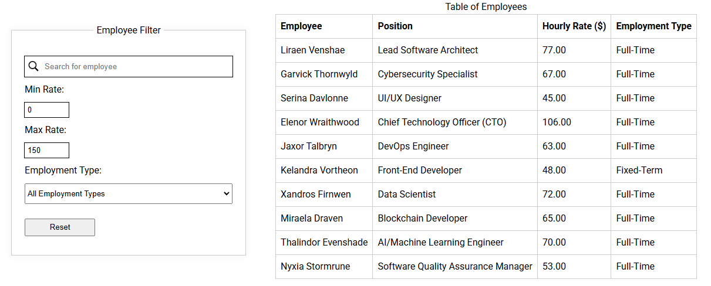

# Employee Data App

This app is designed to load and display employee data from a JSON file. Here's a summary of its features:

1. **Loading Employee Data**: The app fetches employee information from a given JSON file using an `XMLHttpRequest`.

2. **Parsing and Displaying Data**: Upon successful data retrieval, the app parses the response and displays employee data in a structured HTML table.

3. **Employee Information**: Each employee's name, position, rate, and employment types are listed in the table.

4. **Dynamic Filtering**: The app includes placeholders for filtering the employee list based on search criteria, employment type, and rate range (min and max rates).

## Example

## TODO

-   [ ] Add `Salary` to table
-   [ ] Add `sorting` feature (i.e., A-Z, largest to smallest, smallest to largest)
